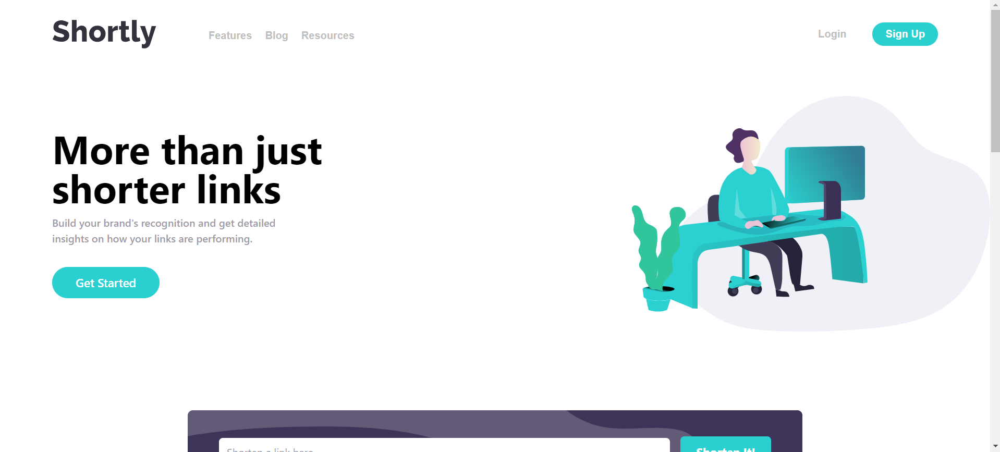

# Shortly - URL Shortening App

This is a solution to the [Shortly URL shortening API Challenge on Frontend Mentor](https://www.frontendmentor.io/challenges/url-shortening-api-landing-page-2ce3ob-G). Frontend Mentor challenges help you improve your coding skills by building realistic projects.

## Table of contents

- [Overview](#overview)
  - [The challenge](#the-challenge)
  - [Screenshot](#screenshot)
  - [Links](#links)
- [My process](#my-process)
  - [Built with](#built-with)
  - [What I learned](#what-i-learned)
  - [Continued development](#continued-development)
  - [Useful resources](#useful-resources)
- [Author](#author)
- [Acknowledgments](#acknowledgments)

## Overview

### The challenge

Users should be able to:

- View the optimal layout for the site depending on their device's screen size
- Shorten any valid URL
- See a list of their shortened links, even after refreshing the browser
- Copy the shortened link to their clipboard in a single click
- Receive an error message when the `form` is submitted if:
  - The `input` field is empty

### Screenshot



### Links

- Solution URL : [Solution URL](https://github.com/danielace1/url-shortening-app)
- Live Site URL : [Live Link](https://url-shortening-app-livid.vercel.app/)

### Built with

- Semantic HTML5 markup
- CSS custom properties
- Flexbox
- CSS Grid
- Mobile-first workflow
- [React](https://reactjs.org/) - JS library
- [React Hook Form](https://react-hook-form.com/) - For handling form state
- [TailwindCSS](https://tailwindcss.com/) - For styles
- [RapidAPI](https://rapidapi.com/) - For accessing the URL shortening API

### What I learned

While working on this project, I learned several key concepts and techniques:

1. **State Management with React Hooks**: Managing state with `useState` and `useEffect` to handle form inputs and local storage was essential for this project. Ensuring that the list of shortened URLs persisted across page refreshes provided a practical use case for local storage in a React application.

2. **Form Handling with React Hook Form**: Using React Hook Form made it easier to manage form state and validation. Integrating Zod for schema validation provided a seamless way to ensure URLs were correctly formatted before submission.

3. **Asynchronous API Requests with Axios**: Handling asynchronous API requests to the URL shortening service with Axios taught me how to effectively manage promise-based requests and error handling in React.

4. **Copying to Clipboard**: Implementing the functionality to copy shortened URLs to the clipboard with a single click required understanding how to interact with the browser's clipboard API.

Here's a snippet of code I'm particularly proud of:

```js
const clipboard = (url) => {
  navigator.clipboard.writeText(url);
  setCopy(true);
  setClicked(true);
  setTimeout(() => setCopy("Copy"), 2000);
};
```

### Continued development

In future projects, I plan to focus on:

Enhancing user experience with more interactive UI elements.
Implementing more robust error handling and user feedback mechanisms.
Exploring additional React libraries to further streamline state management and API interactions

### Useful resources

- [React documentation](https://reactjs.org/) - This helped me understand the fundamentals of React.
- [React Hook Form documentation](https://react-hook-form.com/) This is an amazing resource for handling form state in React.
- [TailwindCSS documentation](https://tailwindcss.com/) - This helped me with utility-first CSS for rapid UI development.
- [RapidAPI documentation](https://rapidapi.com/) - This helped me integrate the URL shortening API easily.

### Author

- [Sudharsan](https://www.facebook.com/sudharsandaniel01)

### Acknowledgments

I'd like to thank the Frontend Mentor community for providing valuable feedback and inspiration throughout this challenge.
